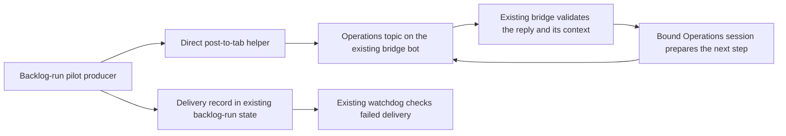

# Alert handoff: findings and proposed routing

Date: 2026-09-06. Status: prepared for owner review. This document does not install
routing, change recipients, create a session, or change backlog status.

## Outcome and recommendation

The owner should receive a decision with enough context to act from the phone.
The assistant should retain the evidence, prepare the next step, and report what
happened. The phone card must identify the issue, project, reason, proposed next
step and stable reference, as shown below; its saved context must resolve the
source evidence and action constraints. An alert sent, a key pressed, and a task completed are different results.
This follows the [automation outcome and improvement test](automation-ops-2026-09-05.md#the-improvement-test).

Recommend one **Operations** tab in the existing Telegram group for feedback,
backlog decisions, and operational incidents. Keep live session permissions and
conversation replies in their originating session tabs. Reuse session-bridge as
the only receiver for its bot. Do not add Slack, another polling consumer, a public
HTTP endpoint, or a second task database for this work.

The destination is a proposal, not an owner selection yet. The existing held item
`2026-09-03-feedback-alert-reply-channel` explicitly requires that selection before
building the new two-way route. Its options are: keep current alerts and move to a
live tab to reply; use a permanent desk tab; or build action buttons. The proposed
Operations tab is the permanent-desk option, covering operations across projects.
Buttons are unnecessary for the first version. The owner was asked for the
preference during this assessment; no answer was recorded when this draft was made.

**Sequence:** repair the existing bridge's approval and failed-send handling first;
then repair the existing senders under the reliability task below; then evaluate
the owner-selected Operations pilot with backlog-run before adding feedback. A central tab alone would move the current failure modes into one place.

## What exists now

Read-only snapshot at **2026-09-06 16:09:27 UTC**:

- `session-bridge.service` was active/running, executing this repository's
  `session-bridge/src/main.ts` with Bun. This is process evidence, not a phone test.
- Six tmux sessions existed; four open bridge topics mapped to live sessions.
  The configured exclusions were `^cai/` and `^codex-`.
- One pending reply flag existed and was older than one hour. The hook expires
  such flags on a subsequent Stop; the blocked watcher checks existence, not age.
- The journal window since September 5 contained zero matching poll, handler, or
  blocked-watch error lines, one topic creation, and two topic archives. Absence
  of these errors does not prove delivery or receipt.
- The current bridge's 76 isolated tests passed. Two additional fake-only probes
  reproduced the approval gaps below. No live messages or key presses were used.

The [bridge README](../session-bridge/README.md) records a successful phone smoke
test on August 5. That is historical evidence, not a fresh end-to-end check.

## Event-to-action map

Scope: the sources named in the alert-handoff task, the feedback producer named
in its held decision, and Bebop as an existing missed-result monitor. This is not
an inventory of every notification in every product.

| Event and source | Destination today | Durable result | Retry / failure today | Action available from the phone today |
|---|---|---|---|---|
| New feedback queued, `sat-prep/scripts/feedback-sync.ts:175-207,237-249` | Main-bot owner DM | Shared backlog item; database queue status; cron output | Notification is best effort after queueing; failed sends do not reopen the queued row for notification retry | Read the item ID, then find a live project tab to ask for work |
| Backlog work finished, `backlogrun/cli.py:1088-1182` | Main-bot owner DM | `.backlog-run/runs`, `reviews`, `report.md` and `report.json`; backlog item | Wrapper returns a delivery-result string; it has no durable retry queue; underlying `tg-send` retries a chunk once | `backlog-run show <id>` gives readiness and full evidence, but the owner must move to a session to act |
| Unattached session becomes BLOCKED or WAITING, `~/.local/bin/agents:105-130` | Main-bot owner DM | A state marker in `~/.cache/agents` | Marker is saved even after send failure; repeats stop while the state persists | Alert offers `tmux a -t <session>`; no direct reply-to-session mapping in this sender |
| Active bridge conversation blocks, `session-bridge/src/main.ts:69-95` | That session's group topic | Topic map, pending flag, journal; notification suppression is in memory | Only pending-flag sessions are watched; suppression and approval arming happen before send succeeds | Reply in the tab, subject to the approval gaps below |
| Phone message / final answer, `session-bridge/src/router.ts:50-134`, `hook/stop-hook.ts:80-132` | Same mapped group topic | Offset/topic state, pending flag, hook log | Failed answer sends retain a flag for a later Stop, not a scheduled retry; flags can expire; inbound handler failures can still advance the saved update offset | Continue the session conversation; queued input may follow an in-flight answer |
| Watchdog condition fires, `watchdog/run.py:214-229`, `triage.py:190-219` | Main-bot owner DM | Watchdog state, logs, metrics history | Suppression is saved before delivery; shell logs send failure, but the same-level condition can remain suppressed for six hours | Read the evidence and direct a session to investigate |
| Bebop failed / overdue result, `watchdog/triage.py:32-60`, `bebop/run-briefing.sh` | Main-bot owner DM | Briefing log and cursor; watchdog record | Existing absence check warns after 14 hours without success; direct failure notice shares the sender that may have failed | Open a session with the relevant briefing evidence |
| Weekly security sweep, `council/scripts/security-sweep.sh:38-49` | Main-bot owner DM | Sweep log records scan exit; stderr log; full report on stdout | Send failure is ignored; final echo can leave shell exit zero after scan failure | Inspect the scan result and prepare a bounded remediation task |
| Stranded work from session-gc, `sessiongc/cli.py:475-513` | Configured DM only when notify flags are used | `.session-gc/report.md`, journal and recoverable refs | Scheduled sweep has no `--notify`; optional `--notify-strict` returns failure if notification fails | Read the report and choose recovery or a merge review |

Paths beginning `.backlog-run` and `.session-gc` above are under `~/projects/`.
The shared backlog remains the owner of accepted tasks. Delivery records belong
with their sender; a retry record is not a second task or a second backlog item.

## Verified gaps and their implications

1. **Acceptance is inconsistently checked.** `bin/tg-send:28-59` discards response
   bodies and treats HTTP 200 as success. Its consumer cannot verify Telegram's
   JSON `ok` or retain the message ID. The bridge's Telegram client checks JSON
   `ok`, but `send()` discards the returned receipt (`src/telegram.ts:24-44`).
   Provider acceptance still does not establish human receipt or task completion.

2. **A failed notification can become suppressed.** `agents:123-125` saves the
   edge marker regardless of curl's result. Watchdog saves suppression before
   its shell sends. The bridge watcher adds `blockedNotified` and arms the topic
   before awaiting `tg.send` (`src/main.ts:87-90`). Detection and accepted delivery
   need separate records; retries must use the delivery result.

3. **Approval is bound to a topic and time, not to the exact prompt.** The reactive
   router arms before awaiting its prompt reply (`src/router.ts:86-87`), and later
   checks only the ten-minute arm window before pressing a key (`:76-94`). A
   fake-only probe made prompt delivery throw, then sent `approve`: the fake key
   sink still received `1`. A second probe changed the blocked prompt from action A
   to action B after displaying A: `approve` pressed `1` for B. These are source
   defects reproduced with mocked dependencies, not claims of a live incident.

4. **Receipt and execution are different for inbound text too.** `main.ts:108-117`
   advances and saves the update offset even after the handler throws. A failed
   injection is reported, but there is no durable failed-action handoff. A crash
   after injection and before offset save can also replay an update. Retrying a
   failed notification is safer than blindly replaying a possibly executed action.

5. **The two session watchers overlap but are not interchangeable.** `agents`
   covers unattached BLOCKED and WAITING sessions generally; the bridge's proactive
   watcher covers open topics with a pending bridge flag. Removing `agents` now
   loses coverage. Keep its dashboard and fallback coverage until the bridge has
   measured equivalent coverage. Retire overlapping nudges only after an explicit
   per-session handoff, not merely because a topic exists.

## Example alert and proposed route

Synthetic example, using the verified watchdog finding. This is not a created
backlog item or a message that has been sent:

```text
Watchdog alert delivery needs a fix
Project: Automation
Why: A failed send can hide the alert for six hours.
Recommended next step: Prepare a fix and tests for review.
Reply to this alert: Prepare the fix.
Reference: demo-watchdog-delivery
```

The event's saved context supplies the exact source paths, current evidence, and
constraints. The owner need not paste those paths into a second conversation.
The assistant returns the prepared change and its review result in the same tab.
A reply to prepare work is not permission to merge, deploy, send, or delete.

Proposed routing change, **after the existing bridge and sender repairs**:



Use a small one-shot `session-bridge/post.ts` helper with the existing `Telegram`
class and bridge configuration. It sends but never polls. Only this helper and the
existing bridge read the existing bot credential; producers receive no token and
cannot choose arbitrary destinations. No inbox queue, file-discovery loop, lease,
public endpoint, or additional listener is part of this proposal.

Proposed config addition: `operationsSession: "ops-desk"` in the existing bridge
config. The session does not exist by virtue of this document. Activation requires
an explicitly created session, a current open topic mapping, and the selected
session/pane generation. Missing or replaced sessions cause a failed handoff, never
routing to another convenient session. The permanent tab is a stable inbox, not
an ever-growing source of project truth: rebuild its context from the referenced
backlog item and evidence when needed.

### Proposed direct-helper contract

`post.ts` reads one UTF-8 JSON object on stdin, maximum 8 KiB. It accepts only:

| Field | Type and constraint |
|---|---|
| `version` | Integer `1` |
| `event_id` | String matching `[A-Za-z0-9._-]{1,128}`; no `..` |
| `producer` | Literal `backlog-run` for the first pilot |
| `item_id` | Existing shared-backlog ID, maximum 200 characters |
| `branch_sha` | Full 40-character commit hash, or null for an item without a branch |
| `observed_at`, `expires_at` | UTC RFC3339 strings; expiry after observation, at most 24 hours later |
| `summary`, `why` | Strings, at most 300 and 500 characters respectively |
| `proposed_action` | Literal `explain` or `prepare_fix`; neither is a command to execute |

Reject unknown fields and invalid/expired input before reading the credential or
sending. Resolve project, current item state, branch and evidence paths from the
existing backlog/report. Reject stale SHA or an unavailable item with a named
`stale_event` or `missing_item` error. Render a single plain-text card under 3,000
characters including the event/item reference; full evidence stays in its existing
files. Do not split actionable cards across messages in this first version.

The producer owns `~/projects/.backlog-run/alerts/<event_id>.json`, containing the
request and its delivery result. Only the producer writes this record, using
temp-file + rename while holding its existing runner lock. The bridge reads it
and owns inbound reply/action outcomes in its own state, linked by event ID and
message ID. It never takes the runner lock or writes the producer record. A reply
arriving before the accepted receipt is saved cannot trigger work; ask the owner
to retry once the receipt is available. These records are delivery evidence, not
another task database. Compare request objects after parsing: key order
is irrelevant; every field/value must match exactly, including string whitespace.
Same ID + same request + accepted receipt means do not resend; changed content is
`event_conflict`, never an overwrite. An event refreshed after new evidence gets a
new ID. A crashed `attempting` record becomes `uncertain`, not safe to resend.

Helper stdout is one JSON object with `event_id`, `status`, `error_code` (null or a
named error), `message_id` (integer only after acceptance), and `destination`
(null before acceptance; otherwise the verified integer `group_id` and `topic_id`,
and nonempty `session_generation` string from the bridge's current binding). The
producer preserves this entire result so replies can validate the original target.
Exit 0 means accepted; exit 2 means rejected input; exit 1 means failed or uncertain
delivery. Success
requires HTTP success, JSON `ok`, and a returned message ID. Error text never contains
credentials. The total request budget, including any retry, is 30 seconds. Retry
only an explicit JSON `ok: false` / error code 429 rejection. If `retry_after` is
a finite nonnegative number of seconds, wait `max(2, retry_after)` seconds and
retry once within the remaining budget. Missing/invalid delay or a delay that
leaves no request time within the budget stays failed. A timeout or server error without definitive rejection is
uncertain; never automatically resend it.

| Delivery transition | Recorded result and visibility |
|---|---|
| Valid current request, destination verified | Save `attempting` before invoking helper |
| Complete accepted API result | Save `accepted` plus message ID; suppress duplicate sends |
| Invalid input, stale item or missing destination | Save `failed` with named reason; no send; show in local report |
| Definitive delivery rejection after bounded retry | Save `failed`; show reason in report and expose to watchdog |
| Timeout, interrupted send, or crash after possible acceptance | Save `uncertain`; local report requests receipt inspection before explicit retry |
| Expiry before any send | Save `expired`; no send; a new action needs fresh evidence |

These states describe delivery, not whether the owner read or completed anything.
There is no background retry executor in the pilot. An explicit retry first checks
item freshness and the recorded acceptance/uncertainty; it reuses the event ID for
known failures and cannot blindly resend accepted or uncertain events. The existing
watchdog surfaces failed/uncertain delivery at its next poll. Both bots use Telegram;
that fallback cannot independently overcome a Telegram outage. Keep the local report
as the reliable place to inspect the failure.

### Proposed reply rules

Authorization comes from existing `groupId` and `allowedUserId` configuration; the
pilot adds no owner. A reply must match the configured Operations topic, the helper's
accepted message ID, the current event and bound session generation. The producer's
delivery record is authoritative; quoted text is context, not authorization.

| Input | Result |
|---|---|
| Allowed owner replies to the matched current card | Recheck item state/SHA, then pass the quoted card and bounded request to Operations |
| Bare “prepare” or “approve”, without a matched card | Reply `Reply to the alert you want me to handle.`; select no event |
| Edited update, forwarded message, other bot/user/group/topic, unknown message ID | No action; edited/forwarded events are excluded from the pilot |
| Duplicate update ID | Return its recorded outcome; never inject twice |
| Expired card, changed item/SHA or replaced session | Reply `This alert is out of date. Ask for a fresh review.`; no action |
| Injection definitely never started | Save `not_injected` and failure reason; an explicit fresh request may retry |
| Injection started but completion is uncertain | Save `uncertain_action`; no automatic replay; require checking the session |
| tmux paste and Enter both succeeded | Save `injected`, not “task completed”; final task outcome comes from the session |

This matrix governs decision-card replies. Live permission replies use the exact
prompt binding specified below, including in Operations. Ordinary conversation in
other session tabs remains unchanged. The Operations session follows the canonical
working agreement at `~/.claude/CLAUDE.md` and the target repository's `AGENTS.md`. It coordinates work;
it is not a callback listener that directly runs `approve`, `drop`, or backlog
mutations. New accepted work still follows propose-then-confirm. Consequential
actions still require their own concrete authorization.

## Cold-runnable first implementation: repair existing bridge handoff

Repo: `~/projects/build-ai-automation-workflow`. Paths: `session-bridge/src/router.ts`,
`src/main.ts`, `src/telegram.ts`, `src/tmux.ts`, `src/state.ts`, `hook/stop-hook.ts`,
and corresponding `session-bridge/test/` files. Paths abbreviated `src/` and
`hook/` in this paragraph are relative to `session-bridge/`.

Task: bind each offered permission action to the captured prompt, session/pane
generation and accepted prompt receipt. Arm only after acceptance. Recheck that
binding immediately before pressing a key; prompt change, session replacement,
expiry or restart must require a fresh display and owner response. Keep the
existing word/number choices and canonical merge authority; a menu number is not
merge approval. Move watcher suppression after accepted delivery; a failed send
remains retryable on its next existing tick. Ignore/expire old pending flags in
the watcher, consistently with the one-hour hook limit. Record failed inbound
handoffs durably before advancing past them. Before invoking tmux injection, save
`attempting`; success of paste and Enter permits `injected`. A validation failure
before invocation is `not_injected`; a crash or error after invocation is
`uncertain_action`. Never automatically replay an uncertain action.

Done: regression tests reproduce both fake approval failures above, then prove
no key press occurs; delivered unchanged prompts still work. Prove pending expiry,
restart, failed sends, duplicate updates and uncertain injection remain visible and
cannot replay an action. Run `bun test session-bridge/test`. Use temporary state,
fake Telegram and fake tmux only. Present the code diff, tests, exact service update
and rollback before any live change. No live sends or service restart in tests.

Before coding the authorization changes, define and review the versioned approval
and inbound-action state schemas, and the session/pane generation algorithm.
Specify creation, session replacement, daemon restart and comparison behavior;
never use a reused session name alone. Persist an inbound outcome before committing
its offset. After durable `not_injected`, `injected` or `uncertain_action`, advance
the offset without replaying that update; if the outcome write fails, stop
processing later updates. On restart, an existing `attempting` outcome becomes
`uncertain_action` before advancing. Test each transition with interrupted writes.

## Operations pilot build, after the destination decision

Repo: `~/projects/build-ai-automation-workflow`. Proposed file:
`session-bridge/post.ts`; extend `src/telegram.ts`, `src/router.ts`, `src/config.ts`,
`src/state.ts`, `backlogrun/cli.py`, and their tests. Session-bridge paths are relative
to its directory. Implement the direct-helper, receipt and reply rules above with
backlog-run as the only producer and one owner-chosen Operations session/topic.
Before implementation, finish the versioned producer-record schema, closed
error-code registry, full allowed state transitions and per-item card supersession
rules, including concurrent cards. Review these together with the bridge binding
schema from the repair task; the interface sketch above does not replace them.
Keep scheduling, backlog lifecycle and merge commands unchanged. Preserve a single
primary route per producer; do not dual-send successful cards to the old DM route.

Done: a locally generated sample card and matching fake reply prepare the correct
existing item. Failed/uncertain receipts appear in the local report. All reply and
delivery rows above are tested with temporary state, fake Telegram and fake tmux.
Show exact configuration, route switch, service update and rollback before enabling.
No live sends, topic creation, credentials changes or daemon restart during tests.

Only then extend `sat-prep/scripts/feedback-sync.ts` with the same helper contract,
adding its producer identity and durable receipt under its existing state. Preserve
its current queueing, database and consent behavior. Its accepted items already have
backlog IDs; do not create duplicates when an alert delivery is retried. This remains
part of the existing decision-gated feedback-channel task until that choice is made.

## Delivery reliability and monitoring follow-on

Same repo: `bin/tg-send`, `watchdog/run.py`, `watchdog/triage.py`,
`watchdog/run-watchdog.sh`, `watchdog/monitors.toml`,
`council/scripts/security-sweep.sh`; tests use fake senders and fixed clocks.

Task: require HTTP success plus JSON `ok` in the shared sender; retain message
receipts and failed attempts without logging tokens. Keep watchdog's detected
condition separate from last accepted notification so delivery failure cannot
start the six-hour suppression period. Preserve scan exit status separately from
send exit status in the security sweep. Add bridge service/delivery-age monitoring
using the existing watchdog; it currently monitors `tailscaled`, not the bridge.
Add configured expected-result checks for backlog-run and the weekly sweep beside
the existing Bebop absence check. Use each job's real schedule and runtime budget.
The weekly sweep starts Monday at 04:00 UTC. Its wrapper has no whole-job runtime
limit; the 40-chunk cap is not a duration budget. Before enabling its overdue
check, inspect scan timeout/retry bounds and observed run durations, then propose
a bounded runtime and completion deadline. Do not invent a deadline from its
start time. For backlog-run, a proposed first deadline is 06:30 UTC: 03:00 start + three-hour
runner budget + thirty-minute margin, not an invented 03:30 completion promise.
Use a completed-run marker, including a valid no-work run; report file mtime alone
is insufficient because a human can regenerate the report. Paused jobs are exempt.

Done: failure retains retry eligibility at the next watchdog poll; accepted sends
start suppression; a later successful run resolves its incident. Never infer
human receipt. A Telegram outage affects both bots: another Telegram message is
not independent escalation. Keep failed delivery visible in local reports and
watchdog evidence. Test a missing/failed/completed/paused scheduled result.

Before changing installed `agents`, complete its source capture under the existing
`2026-08-26-version-vps-loose-scripts` task. Then reuse the checked shared sender,
save its marker only after acceptance, and retain failed delivery evidence. Keep
unmapped/excluded-session coverage until equivalent coverage is demonstrated.

## Acceptance matrix for all routing builds

| Case | Required result |
|---|---|
| Send rejected or network fails | Durable failure/uncertainty; retry only known transient rejection; no accepted-delivery suppression or permission arming |
| Prompt send fails, then owner says approve | No key press; fresh prompt must be accepted before the owner can respond |
| Prompt changes or session name is reused | Old reply cannot press a key or target the replacement session |
| Same producer event repeated | One event record; no new send after accepted delivery merely from a duplicate producer invocation |
| Timeout after possible acceptance / crash before receipt save | Preserve uncertainty; no automatic resend or action replay; never claim exactly-once delivery |
| Old event arrives after recovery or branch changes | Mark superseded/expired or request a fresh review; no stale proposed action |
| Wrong user, group, topic, reply reference, or session generation | No injection, key press, or backlog mutation |
| Duplicate Telegram update | No duplicate action; a received-but-uncertain action is surfaced rather than blindly replayed |
| Owner asks to prepare the fix | Correct event context reaches the chosen session; outcome returns to that tab |
| Owner requests consequential action | Existing working agreement governs the concrete action; alert transport adds no authority |

## Validation and limits

This assessment used source inspection, aggregate local state/journal checks, the
76 existing bridge tests and two fake-only router probes. Credentials were not
printed. No live notifications, daemon starts, topic creation, account changes,
backlog edits or runtime routing changes were performed. The proposed builds and
test matrix are not implemented or validated by these results.

Council reviewed the working-tree diff with the `spec-review` panel. Its final
recommendation approves this as an assessment, with the state/schema definitions
above required before implementation. It also challenges the need for new routing:
repair the reproduced defects first, then judge the pilot by whether the owner can
act on a real item without switching conversations or repeating context. No live
incident or proven demand for a new route is claimed by this assessment.
