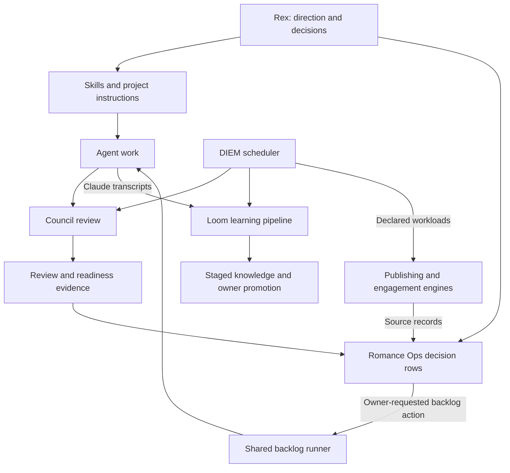

# Portfolio operating harness: mechanisms and connections

**Assessment now available:** the [integrated gap analysis](operating-harness-gap-analysis-2026-09-12.md) judges these mechanisms against the Ideal State and adds subsequent live evidence. This map remains the discovery baseline; its earlier “unverified” labels describe evidence available at discovery time.

12 September 2026. Discovery baseline for the [Portfolio Operating Model](automation-ideal-state.md). This expands the [earlier operations assessment](portfolio-gap-analysis-2026-09-12.md), which covered only part of the harness. It is an inventory and interpretation of what exists, before deciding what deserves repair, reuse, consolidation, or retirement.

## The corrected picture

The harness includes the methods that shape work, the agents and tools that perform it, the checks that judge it, and the loops that carry results into the next action. It includes interactive skills and commands, project engines, model selection, experiments on the machinery itself, memory, services, and human decision interfaces. Cron is only one way to trigger that work.

There is more of the desired operating model here than the first assessment recognized. Council already provides several forms of independent challenge. Skills encode repeatable ways to build and publish. Romance Empire already has a local operations cockpit pattern: source records become decision rows, an owner status change requests an action, and results return to the row. Content engines already connect observation, drafting, owner review, publication, and some performance measurement.

The question for the later gap analysis is therefore: **which existing mechanisms form a useful, dependable loop, and which parts still require Rex to connect them?** A portfolio website should inherit proven capabilities from this harness. Its underlying design cannot be settled from the shared runners alone.

## Evidence and coverage

The [discovery index](evidence/operating-harness-discovery-2026-09-12.json) records 38 project directories, 794 candidate mechanism paths, 27 current local cron entries, installed shared-package comparisons, panel configuration, and aggregate usage metadata. These are discovery counts, not a count of independent initiatives or working automations. Scripts serving one engine are grouped below rather than counted as separate businesses.

Evidence labels:

- **Defined:** a procedure, contract, or design exists. This alone does not establish code or use.
- **Built:** an implementation exists in the inspected source.
- **Installed/configured:** a local executable, active configuration, scheduler entry, or workflow file references it. Remote workflow activation is a separate question.
- **Observed activity:** runtime metadata or retained usage records show activity within their stated scope. Neither proves the intended business outcome.
- **Unverified:** this pass cannot establish the claimed connection, deployment, or benefit.

Eight sampled installed files from Council, DIEM, backlog-run, session-gc, and the usage ledger match the shared repository source byte-for-byte. The installed package identifies itself as Council 0.5.0. The usage ledger contains recorded Council, Loom, publishing, translation, and content-engine activity. Its historical records do not establish current model availability, successful delivery, or return on spending.

## 1. Direction, methods, and agent behavior

| Mechanism | Trigger and working path | Role and current evidence |
|---|---|---|
| Working agreement and project instructions | Session/task -> global agreement -> applicable project instructions -> scoped behavior and owner approvals. | Cross-portfolio policy, not an execution service. [Global agreement](/home/dev/.claude/CLAUDE.md), [project pointer](../AGENTS.md). |
| Initiative Ideal States | Initiative assessment/task preparation -> intended outcome and constraints -> work or a proposed direction change. | Existing initiative sources and the new portfolio target. Reliable ingestion into every worker remains unverified. [Portfolio model](automation-ideal-state.md), [prior canonical-source assessment](loom-ideal-state-assessment-2026-09-09.md). |
| Delegate | Task classification -> saved routing profile -> appropriate worker model/effort -> parent verification and integration. | Installed procedural orchestration across Claude/Codex, distinct from Council. It chooses and coordinates workers; Council supplies independent judgments. [Installed skill](/home/dev/.codex/skills/delegate/SKILL.md). |
| Reusable skills and slash commands | Explicit request or matching task -> prescribed method, tools, gates, and output. | Skills are operating capabilities even when no scheduler invokes them. Some are instructions; others wrap substantial engines. Full families and activation evidence are recorded below. |
| Claude/Codex mirror and configuration tools | Explicit refresh -> metadata inventory -> owned symlinks/wrappers/configuration -> portable access to maintained methods. | Built and installed metadata exists. Native imports, adapters, and connector authentication have different boundaries; an installed copy is not proof of discovery in every client. [Mirror](../setup/claude-codex-mirror/README.md). |
| Harness research and source maintenance | Selected source -> maintained research/playbook/evaluation material -> possible changes to the harness. | A research and evaluation capability, not a running business controller. [Harness Engineering](/home/dev/projects/harness-engineering/README.md). |

### Skills, commands, and hooks are a capability layer

The discovery index retains **84 skill-file entries across the Claude and Codex skill roots**, including mirrors and system skills. This is not 84 unique capabilities. Plugin-provided and project-local skills are additional surfaces; the current session exposes plugin skills as well. The inventory distinguishes copies from activation instead of treating every cached version as another mechanism.

| Family | Existing methods | Trigger -> useful output |
|---|---|---|
| Build and ship websites | `new-site`, `adjust-site`, `preview-site`, `ship-site`, `rollback-site`, `site-flow` | User request -> design/branch/edit -> hosted preview -> checks and owner merge decision -> delivery/recovery. The umbrella and phases are intentional composition, not automatically duplication. |
| Engineering discipline | `using-superpowers`, `brainstorming`, `writing-plans`, `executing-plans`, `test-driven-development`, `systematic-debugging`, `using-git-worktrees`, `dispatching-parallel-agents`, `subagent-driven-development`, `requesting-code-review`, `receiving-code-review`, `finishing-a-development-branch`, `verification-before-completion`, `writing-skills` | Task phase or failure -> structured design, execution, diagnosis, checks, or handoff. These are agent instructions; whether they help or add ceremony needs sampled task evidence. |
| Challenge and delegation | `grilling`, `delegate`, `codex`; Council as a callable tool | Unclear design, sizable work, or review need -> clarified intent, appropriately routed work, or independent challenge. A helper writing code and a panel critiquing it are different jobs. |
| Content and SEO | `seo-article`, `seo-article-setup`, `seo-article-research`, `seo-article-write`, `seo-article-edit`, `humanize`, `content-humanizer` | Editorial request/profile -> research and brief -> draft -> edit/humanize/check. Stage skills support the orchestrator. Publication belongs to its own authorized workflow. |
| Design and media | `frontend-design`, `imagegen`, `venice-ai` | Visual requirement -> design direction, asset generation, or model-specific prompting -> reviewable output. Project visual engines add brand-specific rules and reusable assets. |
| Research and knowledge work | Notion knowledge capture, meeting intelligence, research documentation, spec-to-implementation; deep-research plugin | Question/meeting/spec -> sourced knowledge, preparation, decisions, or implementation inputs. Available in this session; account access and real use were not proven by availability. |
| Extend and maintain the harness | `skill-creator`, `skill-installer`, `plugin-creator`, `openai-docs`, plugin management; `create-command`, `export-skill`, `install-skill`, `setup-mcp` | New capability/configuration need -> reusable method or configured extension. The MCP Configuration Assistant is another setup aid, not an always-running controller. |
| Close work and operate across devices | `close`, `sweep`, `meeting-notes`, `push-to-device`, `claude-connectors`; seven Codex `claude-command-*` wrappers | Session end, notes, access, or transfer request -> retained work, proposed backlog, usable records, or files on the owner's device. Connector policy remains service-specific; Notion uses scoped direct tokens under the working agreement. |

**Activation matters.** Current Codex configuration disables 14 present skill files: the Cloudflare/Workers/Agents SDK group plus `nano-banana`, `tidy`, and `topical-map-dfseo2`. The discovery index names each path. They are available source material, not active default behavior. Claude settings enable Superpowers, frontend-design, Context7, delegate, content-humanizer, and SEO Article Writer; code-review, GitHub, and Telegram plugins are disabled. A disabled Telegram plugin does not disable the separately running session bridge.

**Hooks connect sessions to tools.** Claude's configured `Stop` hook points to [the bridge reply hook](../session-bridge/hook/stop-hook.ts). Superpowers includes a session-start hook, and the local preamble maintenance script has a weekly cron entry. Delegate's plugin contains hook/nudge machinery. Hook presence and enablement were inspected; firing rates and end-to-end behavior were not measured. The Claude transcript hook is intentionally excluded from the Codex mirror because its input format differs.

Project command wrappers are also in the discovery index. Romance's stage commands are the clearest example of a skill driving an actual production pipeline. These should be evaluated at the workflow level, not dismissed as prompt files or counted again as separate engines.

## 2. Judgment, quality control, and improvement of the tools themselves

| Mechanism | Input -> work -> output/consumer | Role and evidence |
|---|---|---|
| Council `ask` and panels | Question/artifact -> independent specialist seats -> chair synthesis, disagreements, recommendation -> owner or calling worker. | Installed. Active panel configuration includes **decision, brainstorm, red-team, code-review, and spec-review**. The README lists only four; installed configuration contains five. [CLI](../council/cli.py), [panels](../council/panels.toml). |
| Council file/diff review and PR review | Changed code/documents plus available context -> specialist review -> code gate or advisory document feedback. | Built, installed, and consumed by shared backlog and repository CI. Chair judgment and deterministic gate rules are separate mechanisms. Review does not grant merge authority. [Review](../council/review.py), [gate](../council/gate.py). |
| Council candidate comparison | Several candidate solutions -> panel ranks alternatives -> chair selects and recommends useful parts. | Built/installed command; generic task-use frequency and benefit unmeasured. Candidate generation is separate. [Compare](../council/compare.py), [parallel attempts](../council/scripts/parallel-attempts.sh). |
| Council security research | Scheduled/manual repository scan -> bounded chunks, specialist findings, deduplication -> report and owner summary. | Current local weekly cron points to the security sweep. It reports rather than implementing fixes. Coverage limits matter. [Sweep](../council/sweep.py), [contract](contracts/council-security-sweep.md). |
| Council regression fixtures and chair bake-off | Known cases -> repeated controlled reviews -> quality, failure, and cost evidence -> proposed model/gate change. | Built harness and retained experiment report. This is already a mechanism for improving the harness itself. Results are limited to sampled cases, not proof that one model wins all tasks. [Regression](../tools/regress/README.md), [chair experiment](chair-bakeoff-results-2026-09-12.md). |
| Deterministic checks and domain review panels | Artifact -> repeatable tests plus domain-specific reviewers -> accept, correct, or ask the owner. | Shared code tests and project-specific quality systems coexist. Romance proofreading, timeline/world checks, mutation tests, and human taste gates are distinct from Council's generic code review. [Publishing instructions](/home/dev/projects/romance-empire/CLAUDE.md). |

The Council loop is worth assessing as a complete capability: why a panel is called, what evidence it sees, what disagreement survives synthesis, what actually blocks action, and whether the result changes a useful decision. Counting review calls would miss both its value and its overhead.

## 3. Work intake, execution, and owner interaction

| Mechanism | Trigger -> work -> result/consumer | Evidence and boundary |
|---|---|---|
| Shared backlog and `/close` | Accepted loose end -> self-contained backlog item -> later execution and owner disposition. | Defined workflow and built queue consumer. `/close` includes a proposal/confirmation step for additions. [Backlog](/home/dev/projects/backlog/README.md), [close command](/home/dev/.claude/commands/close.md). |
| `backlog-run` | Scheduled or explicit eligible item -> isolated cold worker -> Council review and readiness evidence -> owner approval/drop/changes. | Installed; 03:00 UTC cron. Its work phase and owner-triggered merge phase have different powers. [Runner](../backlogrun/README.md). |
| Attain Prep Notion work queue | Owner-ready product task -> claim and bounded isolated agent -> recoverable result -> Notion review state. | Installed versioned release, timer, health metadata and two published journal records observed in the earlier pass. Product outcome not yet established. [Queue source](/home/dev/.local/share/codex-worktrees/notion-work-queue/workqueue/README.md). |
| `fixit` | Manually supplied/queued issue -> constrained repair, commit and test checks -> PR -> existing Council CI and human merge. | Built; default dry-run. A fully automatic incoming-issue trigger is described as later work, not established here. [Fixit](../fixit/README.md). |
| DIEM | Banked/discovered work and available credits -> budget/deadline-aware queue -> Council, Loom, images, or allowed command -> staged results. | Installed; four current local checkpoints. A scheduler of other capabilities, not its own author/editor/reviewer. [Runner dispatch](../diem/runners.py), [DIEM](../diem/README.md). |
| Romance Ops | Repo providers and manual tasks -> Notion rows/Today page -> owner status/comment -> exact permitted command -> result and state. | Built; current cron invokes `ops-tick.sh` every ten minutes **without `--create-only`**, plus daily compose. This verifies an action-capable configuration, not successful live decisions. [Runbook](/home/dev/projects/romance-empire/docs/ops-loop.md), [providers](/home/dev/projects/romance-empire/src/ops/providers.py). |
| Telegram session bridge and `agents` | Session state -> attention signal -> owner reply or session attachment -> ongoing worker. | Bridge service observed active; nudge cron installed. They partly overlap but serve different interaction paths. Existing delivery/action-identity concerns remain in the earlier assessment. [Bridge](../session-bridge/README.md), [recovery tools](/home/dev/projects/vps-tools/README.md). |
| Bebop | Morning/evening schedule -> email/calendar context and Loom summary -> owner briefing. | Configured twice daily. Personal-assistant capability; not proof of portfolio operating coverage. [Bebop](../bebop/README.md). |

**Important reuse candidate:** Romance Ops already combines backlog reviews, launch events, social plans, recurring tasks, engagement items, and production gates. It is not a portfolio website, but it is a closer existing example of the required decision loop than a generic dashboard mockup. Its scope, authority checks, recovery, and performance should be tested before extending it or recreating the same mechanism elsewhere.

## 4. Initiative engines and specialist pipelines

| Family | Mechanisms already present | What connects, and what remains unverified |
|---|---|---|
| Romance book production | `/new-series`, `/new-book`, `/advance`, `/status`; role-routed drafting/editing; artifact-derived stage state; structural approval, proofreading, taste-read, packaging and manual publication gates. | Intent/canon -> manuscript -> checked release package. Source describes explicit human gates and feedback into prompts/policies. Actual passage of each book through every gate requires an initiative audit. [Instructions](/home/dev/projects/romance-empire/CLAUDE.md). |
| Romance quality and learning | Whole-book audits; anchored mechanical patches; timeline/world extraction followed by code checks; clarity/coherence/knowledge probes; planted-defect tests; recorded editor lessons. | A substantial domain-specific correction and learning system. Generic Council should not automatically replace it. Useful detection versus repeated low-value passes is unmeasured here. [Script index](/home/dev/projects/romance-empire/docs/scripts-reference.md). |
| Romance copy, visual assets and campaign production | Blurb engine and shared copy surfaces; brand/reference bibles; covers, image conditioning, teaser cards, deterministic motion, image-to-video reels; calendar and preview dashboards. | Canon and brand data -> reusable assets/copy -> release surfaces. Installed usage ledger records drafting, image, video and editorial calls; accepted quality and conversion are separate evidence. [Script index](/home/dev/projects/romance-empire/docs/scripts-reference.md). |
| Romance distribution and performance | Bento sequences and broadcasts; Zernio calendar scheduling and metric pull; Cloudflare link-click retrieval; social scorecards. | Draft/approve/schedule -> distribution -> some observed performance. These are partly closed loops already. External account state and causal sales impact were not checked. [Script index](/home/dev/projects/romance-empire/docs/scripts-reference.md). |
| Romance engagement | Watchlists/discovery -> source posts/comments -> classification and filtered drafts -> owner Notion queue -> later outcome check and scorecard; persona/taste data feeds the drafter. | Current daily 05:30 UTC cron references the scanner. Posting is not established as automatic. Paid research and owner attention are inputs to the experiment, not proof of cash benefit. [Scanner](/home/dev/projects/romance-empire/src/social/engage_scan.py). |
| SwimTrack editorial discovery | RSS -> ranking/scope/reframing/critique -> review queue -> approved archive -> newsletter and long-form briefs. | Separate from the website writing engine. Local GitHub workflow schedules a daily scan and produces artifacts/issues; actual remote run status unverified. [Editorial](/home/dev/projects/swimtrack/editorial/README.md), [workflow](/home/dev/projects/swimtrack/.github/workflows/editorial-scan.yml). |
| SwimTrack website delivery | Morning writing queue, previews/digest, owner decisions, publish/revise/dismiss poller; translation and hero-image pipelines. | Current weekday cron references morning and decision polling; usage ledger records translation/image activity. A transfer from the separate editorial queue into this engine still needs proof. [Morning contract](/home/dev/projects/swimtrack-website/engine/MORNING.md), [poller](/home/dev/projects/swimtrack-website/engine/poller-cron.sh). |
| Ultimate Portugal content improvement | Writing engine and decision poller; SEO work; published-content refresh; rent-data verification. | Current cron references all four kinds, including the refresh loop missing from the older schedule inventory. Owner-only digests, content source, approval, and deployment need one traced journey. [Instructions](/home/dev/projects/ultimate-portugal/AGENTS.md), [engine](/home/dev/projects/ultimate-portugal/engine/). |
| Attain Prep product and customer loops | Learning plan/tutor/progress; feedback intake into backlog; product work queue; parent digest; Bento contact/event sync. | Customer signals -> work and communications through several mechanisms. Current local schedules confirm feedback, digest and sync configuration; customer delivery and product learning remain unverified. [Product](/home/dev/projects/sat-prep/README.md), [contracts](contracts/README.md). |
| MeetTrack and SwimTrack coaching | Meet discovery/polling/entry ingestion; coaching product and related infrastructure. | MeetTrack cron entries are explicitly paused in the prior contract; a paused product is not a failed active engine. Current remote service/data state is unverified. [Paused supply map](contracts/README.md). |
| Finance and personal operations | Rebalance check -> proposed ticket -> verification; monthly bid-packet analysis -> ranked choices and bidding snippets. | Built/manual entrypoints, not evidence of automated transactions. [Finance scripts](/home/dev/projects/finance-tracker/package.json), [monthly bidding](/home/dev/projects/monthly-bidding/README.md). |
| Research, opportunity selection and other sites/products | GovCon hunting workflow; source research; sites with local build/deploy/CI configuration; project-specific commands. | Breadth discovery covers all local project directories. A documented hunt process is not proof of a running lead engine. Product/web build scripts alone do not prove an improvement loop. [GovCon](/home/dev/projects/govcon-hunt-list/README.md), [directory index](evidence/operating-harness-discovery-2026-09-12.json). |

## 5. Memory, spending, recovery, and infrastructure

| Mechanism | Working path | Evidence and responsibility |
|---|---|---|
| Loom and wiki promotion | Session transcripts -> distill -> route -> weave into staged knowledge -> owner-reviewed promotion; DIEM can drive backlog weaving. | Installed pinned runtime and local schedule; usage records show each model stage. `wiki-promote` also pulls/pushes the wiki. Retrieval by future workers remains a distinct step. [Loom](../loom/README.md), [installed promote](/home/dev/.local/bin/wiki-promote). |
| Memory, wiki and project evidence | Saved context/decisions -> later retrieval or instruction loading -> changed work. | Existing stores and retrieval studies. Historic explicit-read counts undercount other access and cannot justify deleting material today. [Retrieval study](context-retrieval-2026-07-23.md). |
| Usage ledger, portable records and billing reconciliation | Model response -> project/task usage row; export/ingest -> consolidated ledger; bill comparison -> discrepancies/recovered unmatched spend. | Installed code and populated read-only ledger observed. Billing-recovery wrapper exists but its proposed cron is absent from the current local schedule. [Ledger](../venice_usage/ledger.py), [portable records](../venice_usage/portable.py), [reconciliation](../venice_usage/reconcile.py). |
| Resource controls | Model/role selection, response ceilings, scoped transport caps, DIEM balance/floors/deadlines -> bounded calls/work. | Several existing controls, not one shared portfolio allocator. The transport cap is a local pre-call check of prior spend, not a provider-enforced total; in-flight calls can exceed it. [Council limits](../council/config.py), [budget transport](../tools/budget_transport.py). |
| Watchdog and health signals | Service/log/metric observations -> issue triage -> prepared alert. | Existing monitoring capability and local schedule; scope gaps remain. [Watchdog](../watchdog/README.md). |
| Work preservation and tool recovery | `session-gc` snapshots/branch classification/journal; versioned runtime releases; captured VPS scripts and install checks. | Installed and scheduled mechanisms preserve work. The separate `vps-tools` repository now exists, superseding the older concern that these four scripts had no versioned home. [Session GC](../sessiongc/README.md), [VPS tools](/home/dev/projects/vps-tools/README.md). |
| Access, hosting, connectors and deployment | Tailscale/SSH/tmux and device transfer; Claude/Codex tools/connectors; GitHub review/deploy workflows; Workers/VPS and project backends. | Supporting infrastructure. The prior read-only Cloudflare pass found 13 scripts in one account; Access/Pages reads were denied. Configured MCP names do not establish working account access. External n8n/Bento/Zernio/Notion/Supabase flows need their own read-only inventories where not represented by local source. |

## How these pieces relate to OODA

| OODA responsibility | Existing contributors | Connection to test in the gap analysis |
|---|---|---|
| Observe | Customer feedback, editorial scanners, social metrics, engagement outcomes, watchdog, usage/billing records. | Are signals complete, fresh, and tied to the right initiative outcome? |
| Orient | Ideal States, project canon, skills, research, Council decision/red-team, specialist critiques. | Does the worker use current intent and contradictory evidence rather than just its task brief? |
| Decide | Rex's explicit decisions; Council recommendations; approved standing rules; Notion/engine decision interfaces; scoped queues. | Does a decision identify the exact action, resources, tradeoffs, and authority? |
| Act | Agents, backlog/fixit/product runners, writing/publishing engines, email/social pipelines, deployment workflows. | Does authorized work complete with recoverable, checked results? |
| Feed results back | Domain quality checks, metrics pulls, experiment reports, editor lessons, Loom, state/result records. | What demonstrably changes in the next decision or execution? Stored output alone is insufficient. |

This is a responsibility map, not a claim that these components already share one automatic OODA loop.

The strongest existing connections can be pictured this way. Arrows name the relationship; they do not assert that every handoff is reliable or unattended.

Other initiative queues, content-engine decision interfaces, and the personal briefing remain separate paths. Their existence is part of the map; combining them is an audit question, not a conclusion from this diagram.

## What changes in the audit approach

1. Use this mechanism map as the baseline. Reconcile uncovered remote services, active branch implementations, and project-local methods before claiming completeness.
2. Trace representative existing journeys: Council-assisted work; Romance Ops owner decision; a content engine from signal to result; a learned correction reaching a fresh worker. Check the interfaces, not just each component in isolation.
3. Judge each mechanism separately on purpose, execution, and net contribution. An effective skill can be valuable without being automatic. A dependable engine can still produce low-value work.
4. Only then propose the website's shared responsibilities and what to reuse, combine, repair, retire, or add. Keep the earlier confirmed defects, but treat its build order as provisional.
5. Continue initiative-by-initiative assessment under the same model. Do not infer that the largest repository deserves the most funding or that the most elaborate engine has the greatest value.

### Remaining coverage, explicitly

Every non-hidden directory under `/home/dev/projects` is named in the discovery index. Shared repositories, site variants, personal projects, paused products, and uncertain ownership remain distinct. The source sweep excludes dependency trees, generated outputs, transcripts, customer records, and historic worktree copies. It does not classify a finance, tax, or research project as inactive merely because no schedule was found.

Before declaring the harness fully mapped, the next read-only discovery must cover remote-only workflows and resolve candidate mechanisms with no owning family. Start from the index's project paths, the installed skill/configuration records, and the referenced external services. Inspect existing scoped account connections without running jobs. For each additional mechanism, record its owner, trigger, input, outcome, authority, result destination, consumer, and deployment evidence. Include relevant off-main implementations and remote/device scripts; do not equate a missing local file with an absent capability. Done means every discovered candidate has an owning family or an explicit unresolved/excluded reason, and each asserted cross-tool connection has a source. This is discovery, not permission to migrate, retire, or rebuild it.

No jobs, owner actions, live services, account permissions, or deployments were changed during this discovery. No new Council or other paid inference experiment was run. Helper research used the existing agent clients; this is not a claim of zero audit resource use.
