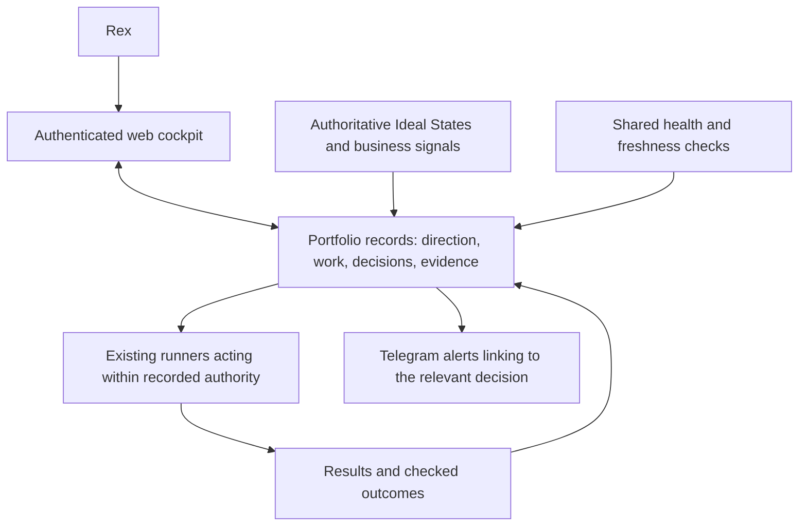

# Portfolio Operating Model: preliminary shared-operations gap analysis

**Superseded as the overall assessment:** see the [integrated operating harness gap analysis](operating-harness-gap-analysis-2026-09-12.md) for the current judgments, initiative conclusions, and work order. This document preserves the earlier, narrower operations pass.

12 September 2026. First shared-system assessment against the [Ideal State](automation-ideal-state.md). Initiative-level business assessments follow this pass. Findings distinguish inspected code, observed runtime metadata, and unverified coverage. No live jobs, queues, notifications, deployments, or authority rules were changed.

**Scope correction:** this assessment did not inventory the full operating harness. The [mechanism and connection map](operating-harness-map-2026-09-12.md) adds Council's wider capabilities, skills/commands/hooks, project engines, model evaluation, learning, and existing decision interfaces. In particular, Romance Ops already implements an initiative-level source-to-decision-to-action pattern. Retain the evidenced findings below within their inspected scope, but treat the proposed architecture and build order as provisional until the broader harness is assessed.

## Judgment

There are useful execution tools to retain. The largest gap is the connection from portfolio direction to authorized work, verified outcomes, and the next owner decision. Today those records and interactions are split across components. A login website can give Rex the coherent operating surface he wants, provided it reads and updates those underlying records reliably.

Streamlining means fewer competing responsibilities and fewer handoffs Rex must reconstruct. It does not require putting every workload on one vendor. The first build should connect useful existing parts and prove a complete journey before adding more machinery.

## What exists and what that proves

| Part | Evidence from this pass | Judgment |
|---|---|---|
| Notion product queue | The installed Attain Prep controller reported healthy; its timer was active, and its local journal contained two published run records. Installed runner, controller, and Notion adapter matched the inspected source byte-for-byte. | A working task-to-result path worth reusing; this does not prove useful product outcomes. |
| Shared backlog runner | Current source produces Markdown/JSON reports and distinguishes readiness from merge authority. | Useful execution and review machinery; retain it. |
| Telegram session bridge | The user service was active. Its entrypoint points to this repository; source checks the allowed user and maps topics to sessions. | Useful remote interaction, but a session interface does not establish a portfolio decision record. |
| Bebop | Its current morning prompt covers email, calendar, and an appended Loom summary. | Keep the personal briefing role; it does not cover the requested operating cockpit. |
| Cloudflare | The configured account returned 13 Worker scripts. Access-app and Pages-project listing each returned HTTP 403. | Existing hosting to consider reusing. No portfolio cockpit was identified in the inspected sources or script names; authentication and other deployment coverage remain unverified. |
| Watchdog | Current source checks selected services, logs, and metrics. | Useful checks with incomplete coverage; its healthy result cannot represent the whole portfolio. |
| Loom | Installed discovery reads Claude session files; its extraction prompt prioritizes personal knowledge. | Useful personal memory, incomplete as a project evidence and cross-client learning path. |
| DIEM and usage records | Current code records runs, duration, and credit use, with budget/deadline controls. | Useful inputs to allocation, insufficient evidence of business return. |

Runtime/API observations, installed-source hashes, and the offline dependency probe are preserved in the [evidence snapshot](evidence/portfolio-top-level-2026-09-12.json). Historical contract counts are not treated as a current full inventory. An inactive `oneshot` service between successful timer ticks is normal; it was not classified as broken.

## Consequential gaps

### G1. A coherent web cockpit and shared operating record are not established

**Classification: missing integration in the inspected scope.** AUTO-IS-01, 03, 09, 10; D28-D29.

The backlog runner produces its own report, DIEM produces another, Notion holds a separate product queue, and Bebop produces a phone briefing. No inspected interface reconciles these into one initiative/work/decision/outcome picture. See [backlog reporting](/home/dev/projects/build-ai-automation-workflow/backlogrun/cli.py:1201), [DIEM reporting](/home/dev/projects/build-ai-automation-workflow/diem/report.py:15), and [Bebop's scope](/home/dev/projects/build-ai-automation-workflow/bebop/prompts/briefing-morning.md:10).

**So what:** a new page could merely make the existing fragmentation look tidier. Rex would still have to establish which status is authoritative and what a decision actually changes.

**Recommendation:** define a minimal shared record for initiative identity, authoritative Ideal State, evidence freshness, work/run identity, authority, resource use, decision, and result. Render the website from those records. Reuse existing task/result stores through explicit adapters before choosing a new database or replacing queues. Every displayed status needs a source and time; unavailable coverage must remain visible.

### G2. Direction and learning do not reliably reach the next worker

**Classification: worthwhile mechanisms with a broken connection to the desired outcome.** AUTO-IS-02, 04, 12.

The installed [product runner's prompt](/home/dev/.local/share/codex-worktrees/notion-work-queue/workqueue/runner.py:50) includes the task brief, done condition, checks, and feedback, but no explicit retrieval of the authoritative Ideal State or its current evidence. Its installed code matches this source. Repository instructions might provide some context; this pass does not establish reliable inheritance across all worker paths.

Installed [Loom configuration](/home/dev/loom-runtime/loom/cli.py:56) selects `.claude/projects`; [discovery](/home/dev/loom-runtime/loom/discovery.py:50) selects transcript files and excludes completed session identities. It does not implement Codex session ingestion or a cursor for later additions to completed sessions. The [distillation policy](/home/dev/loom-runtime/loom/prompts/distill.md:5) prioritizes personal knowledge and caps technical/operational items at two.

**So what:** saved information is not yet a dependable OODA loop. Accepted direction or consequential project evidence can be absent from a fresh worker's context.

**Recommendation:** keep personal memory's purpose intact. Supply the current authoritative Ideal State and relevant evidence at task preparation, with source/version/freshness. Preserve explicit owner decisions separately from agent hypotheses. Prove that one fresh worker uses one accepted decision, and that its checked result reaches the next assessment, before expanding capture across every client.

### G3. Delivery and approval handoffs contain concrete reliability defects

**Classification: defects in inspected source; actual lost or misapplied owner actions were not measured.** AUTO-IS-05, 09, 11, 13.

- The installed [`agents once`](/home/dev/.local/bin/agents:120) records its notification-state marker after a send attempt even if the send fails. That can suppress another nudge while the blocked state persists.
- The shared [Telegram sender](/home/dev/projects/build-ai-automation-workflow/bin/tg-send:28) discards the response body and treats HTTP 200 as success; it retains no provider message receipt. DIEM has a [similar HTTP-only check](/home/dev/projects/build-ai-automation-workflow/diem/report.py:37). Neither proves owner receipt or a decision.
- The [watchdog saves suppression state](/home/dev/projects/build-ai-automation-workflow/watchdog/run.py:225) before its wrapper [attempts delivery](/home/dev/projects/build-ai-automation-workflow/watchdog/run-watchdog.sh:109). Delivery failure can therefore leave an issue suppressed.
- The bridge's [approval state](/home/dev/projects/build-ai-automation-workflow/session-bridge/src/router.ts:25) binds a time window to a topic, not a durable identity for the exact pending action. In one path it arms before awaiting the prompt send. This needs repair and testing before it is reused for cockpit approvals.

**So what:** failure can be hidden at the point where Rex needs a dependable signal or precise decision. A new web button must not inherit these assumptions.

**Recommendation:** reuse one durable event/decision path with explicit send failure or uncertainty and an exact action identity. Verify the response before treating delivery as accepted; retain unresolved decisions independently of notifications. Keep unrelated work running. Existing [handoff repair proposals](alert-handoff-2026-09-06.md) contain relevant work; refresh and reuse them rather than creating another bot. Do not retire overlapping notification paths until their actual coverage has been reconciled.

### G4. Health monitoring has blind spots

**Classification: incomplete coverage.** AUTO-IS-01, 09, 11.

The watchdog's [service/log list](/home/dev/projects/build-ai-automation-workflow/watchdog/run.py:37) and [collection path](/home/dev/projects/build-ai-automation-workflow/watchdog/run.py:181) do not provide expected-result coverage for the product queue, session bridge, shared backlog runner, DIEM, session-gc, or security sweep. Missing optional logs can be skipped. The product queue has its own local health file, but that is not part of this watchdog collection.

**So what:** selected checks can be green while an important responsibility has stopped producing results.

**Recommendation:** extend the existing watchdog with scheduled-result and evidence-freshness checks tied to the actual responsibility inventory. Distinguish healthy, failed, intentionally paused, and unobserved. Use known schedules and legitimate observation windows. The cockpit should show its own data-source failures, not depend solely on the same Telegram channel to report them.

### G5. Source and installed versions need reconciliation before new builds

**Classification: one reproduced dependency defect plus deployment-management complexity.** AUTO-IS-04, 11, 13.

This repository's [review workflow](/home/dev/projects/build-ai-automation-workflow/.github/workflows/venice-review.yml:30) installs `council` at `4a01298`. Its [current review script](/home/dev/projects/build-ai-automation-workflow/scripts/venice_review.py:186) requires `Settings.max_completion_tokens`, which that version lacks. An offline probe of the pinned class reproduced `AttributeError`. This is not a claim that a new CI run was triggered. The [existing rollout runbook](ci-usage-rollout-2026-09-12.md) already identifies a repair path.

The working Notion queue is installed from a versioned release and its source is on the `claude/notion-work-queue` checkout. It is not present in the inspected main checkout's source inventory. The versioned release is a useful recovery mechanism, but a main-only redesign would overlook reusable code.

**Recommendation:** repair the review dependency using the existing scoped change; establish the source revision and installed entrypoint for each retained component. Keep deployment and rollback records with the code. Do not rebuild the queue because its implementation was missed on another branch.

### G6. Resource consumption is better represented than portfolio value

**Classification: partial capability and a possible source of unnecessary work.** AUTO-IS-06, 07, 15.

DIEM prioritizes by [banked status, task type, and creation time](/home/dev/projects/build-ai-automation-workflow/diem/queue.py:75). Its drain can [seed backfill when its queue is empty](/home/dev/projects/build-ai-automation-workflow/diem/drain.py:154). It has useful pause, floor, deadline, retry, and dry-backfill controls. These protect resource use but do not establish which initiative benefits most. Its [report](/home/dev/projects/build-ai-automation-workflow/diem/report.py:18) describes jobs and cost, not realized cash or what released owner time enabled.

**So what:** expiring credits and available capacity can generate activity without a demonstrated contribution. Conversely, existing spend records are worth retaining rather than rebuilding.

**Recommendation:** connect justified work to allocations and outcome evidence. Leave capacity unused when no useful work is identified. Keep cash, owner hours, and the EUR 75/hour nominal valuation separate. Use sampled evidence of benefit and maintenance cost to decide whether backfill, repeated reviews, or extra reporting merit their overhead. This pass has not established that every backfill is wasteful or measured total waste.

### G7. Monthly governance is agreed but not yet demonstrated

**Classification: newly defined capability; implementation unverified.** AUTO-IS-08, 14, 16, plus 07.

No integrated monthly record was found in the inspected shared producers that connects allocations, expected versus observed outcomes, experiment decisions, the validity of each Ideal State, and Rex's next decision. This is a new agreed requirement, not evidence that an older tool failed its original purpose.

**Recommendation:** start with one compact monthly portfolio record, using existing evidence. Show what remains justified, what changed, what is unknown, and what Rex must decide. Keep dependable practices when they meet the initiative's needs. Do not build a separate maturity-scoring service or manufacture framework-adoption work. The date and exact format remain owner choices.

## Lean target arrangement

This is a proposed arrangement of responsibilities, not a selected software stack or implementation approval.

Notion can remain an authoring or source system where it is already authoritative. Telegram can carry timely alerts and links. Workers and the VPS can continue their appropriate hosting/execution roles. The cockpit owns the coherent owner experience; supporting components need clear responsibilities and reliable interfaces, not competing copies of direction.

## Order of work and next initiative pass

1. Reconcile the initiative/component/source map and repair the known review and delivery defects. Preserve working recovery paths.
2. Establish the minimum shared records and build a thin authenticated cockpit view over existing results. Show incomplete coverage explicitly; do not pretend all initiatives are integrated on day one.
3. Connect owner decisions to exact existing actions with durable result recovery, retaining current approval boundaries.
4. Prove a complete initiative journey, then extend only the mechanisms that proved useful. The monthly review uses the same evidence.

**Next bounded analysis: Attain Prep.** It is a useful first integration case because the product queue, canonical Ideal State pointer, feedback path, and deployed site are identifiable. This is an audit-order recommendation, not a new business funding priority.

Read `/home/dev/projects/sat-prep/AGENTS.md`, its `IDEAL_STATE.md` pointer, the authoritative Notion page using the existing Attain Prep scoped token, current feedback entrypoints, and the installed workqueue paths identified above. Trace: outcome signal -> interpretation against Ideal State -> selected work and authority -> result -> owner decision -> updated evidence. Report idea value, execution, net contribution, and the smallest useful repair for each gap. Use read-only evidence; do not launch jobs, change Notion, deploy, send messages, or assume the untracked files in a main checkout reach a fresh worktree.

After that reference journey, map remaining initiatives from their authoritative sources. Directory count is not initiative count: previews, worktrees, shared services, and paused ventures must be distinguished. Subsequent initiative assessments belong under this top-level model and must not silently change its decisions.

## Limits and audit effort

This pass did not inspect all remote accounts, exercise a logged-in cockpit, measure customer outcomes, or determine portfolio cash flow. The Cloudflare token's denied Access/Pages reads remain unknown; no additional authority was requested. Historical documents guided checks but did not establish current deployment.

The shared-flow helper reported 145,355 tokens used. This is a tool-reported token measure, not a cash cost or the full session total. That reading pass was too broad for a lean first assessment. Later initiative passes should follow a bounded journey and inspect additional source only to resolve a named uncertainty. Compaction and this report are artifacts, not proof that operational gaps have been repaired.
